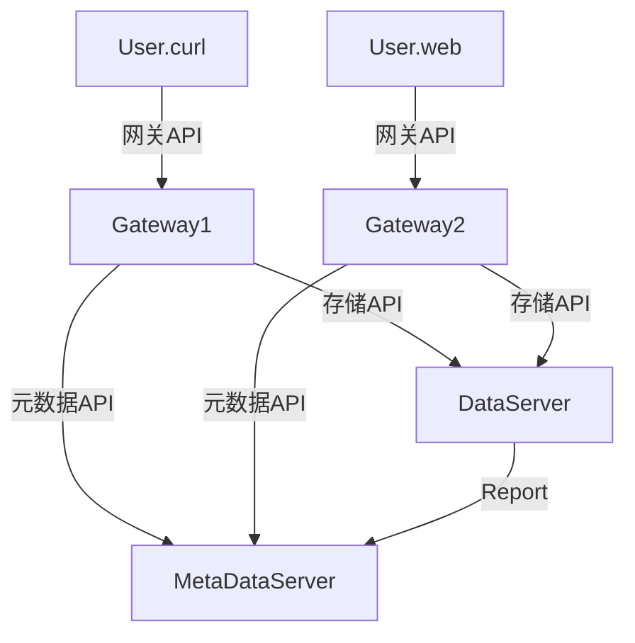

# GOS: General Object Storage （通用对象存储）

新一代通用对象存储系统，基于原MOSS的实践经验总结，重点应对容器云环境下的部署和运行挑战，提供更便捷的客户端协议。

[[_TOC_]]

## 1. 整体结构

GOS分为存储服务器（DataServer/DS/ds）、元数据服务器（MetaDataServer/MDS/mds）、网关服务器（GatewayServer/GS/gs）三个主要组成部分，每部分都采用HTTP接口访问。

```cmd
                                  +--------------+                   +-------------------------------------------+
+--------------+         /------> |   Gateway    | -----+----\       |                      +------------------+ |
|     User     | -------/         +--------------+      |     \----> |                      |     namespace    | |
|    <curl>    |                  |   Gateway    |      |            |    MetaDataServer    +------------------+ | <---\
|    <web >    | -------\         +--------------+      |            |                      |     namespace    | |     |
+--------------+         \------> |   Gateway    |      |            |                      +------------------+ |     |
                      HTTP        +--------------+      |            |        (User)                 ...         |     | R
                                                        |            +-------------------------------------------+     | e
                                                        | HTTP                                                         | p
                                                        |            +-------------------------------------------+     | o
                                                        |            |                                           |     | r
                                                        |            |                             (Device)      |     | t
                                                        |            |                          +-----+------+   |     |
                 GOS Architecture                       \----------> |      DataServer       <Set1> <Set2> <Set3>| ---/
                                                                     |                       <Set4> <Set5> <Set6>|
                                                                     |                               ...         |
                                                                     |                                           |
                                                                     +-------------------------------------------+
```

### 1.1 存储服务器

存储服务器实现最基本的数据读写操作，每个存储服务器**只管理**一个存储设备（例如一块磁盘、一个目录）。每个设备上的数据按照集合（Set）组织管理，集合只在名字解析和存储管理的过程中使用，对用户来说是透明的。

集合是最小的存储单元，保存了每一个Key对应的头（header）信息、属性（prop）信息和数据信息（value）。在存储组织上，每个集合单独存储为一个目录，其中包含了一个.META文件，一个.KEY文件和一组数据文件[0, 1, 2, ...]。其中.META文件记录了集合本身的元信息，.KEY文件记录了每个Key对应的数据文件ID（fileN）、文件偏移（offset）和数据长度（length），记录了Key对应的所有信息数据。数据文件默认最大size为128MB，当文件增加超过最大size时，系统会自动切换至一个新的数据文件。

设备逻辑上是一个存储空间，由一组集合构成。管理员可以固定的创建一组集合，也可以动态创建新的集合。设备将来自于远端的PUT/GET等请求按照集合路由到对应的集合上，转换为对物理存储空间的读写操作。

一般情况下，存储服务器之间没有任何通信，互相并不感知对方的存在。存储服务器在启动时，通过从设备中逐层加载.META等元信息文件，构建自身服务所需的内存管理结构，并将核心的集合到设备的映射信息以报告（Report）的形式发送到元数据服务器，帮助元数据服务器构建动态更新的映射关系。同时，在存储服务器的运行周期中，报告以固定间隔定期发送到元数据服务器上。

### 1.2 元数据服务器

元数据服务器实现从Key到存储服务器（或存储设备）的映射管理，同时它还实现了名字空间、用户的管理。名字空间（namespace）是指一个逻辑上的Key命名空间。每个名字空间中的Key不能有重复。用户即GOS服务的使用者。每个名字空间具有一组可读用户（read user）和一组可写用户（write user）。用户在使用GOS服务时需要首先登录（login）实现认证过程，后续的所有操作均需要携带用户认证后的token来确保鉴权可以顺利进行。鉴权过程发生在所有的PUT/GET和管理操作中。一般来说root用户具有操作GOS所有数据和元数据的权限，其他用户只能操作自己已被授权的名字空间。

在Key到存储服务器的映射管理中，元数据服务器建立了Key到集合的映射表（MDS自行管理与存储）、集合到设备的映射表（由DS汇报动态构建），设备到存储服务器映射表（由DS动态汇报构建）。

元数据服务器实现了PUTW操作，任何一次PUT类操作首先需要访问元数据服务器以获取一个许可（warrant），许可中记录了该次写入的Key、集合、数据长度。元数据服务器管理着写入时的数据分布策略，目前有随机分配、剩余空间均匀分配、剩余空间率均匀分配、已用空间均匀分配和已用空间率均匀分配。任何一次GET类操作也需要首先访问元数据服务器以将Key解析到一个集合和一个设备（存储服务器URL）。

### 1.3 网关服务器

网关服务器是GOS系统的非必须部分，其主要作用是为了简化用户使用，屏蔽在一次读写操作中涉及的多次元数据服务器和数据服务器访问。网关服务器本身不存储任何状态信息，在部署时可以根据需要扩大规模以提升服务吞吐率。

## 2. API

根据上一章的描述，GOS的API分为三个部分，首先是网关API，其次是元数据API和存储API。



### 2.1 网关API

#### 2.1.1 用户登录

用户登录实现用户基于口令的登录和认证功能，认证成功后返回一个有效的token。

- URL
  ```
  http://[ip]:[port]/api/v1/login
  ```

- Method
  ```
  POST, PUT
  ```

- URL Params
  ```
  None
  ```

- Data Params
  ```json
  {"user": "put_user_name_here", "password": "put_user_password_here"}
  ```

- Success Response
  - Code: `200`
  - Content:
  ```json
  {"state": 0,"token":"5g11aI"}
  ```
  其中，`state`值为0表示正常，认证成功返回的`token`为`5g11aI`

- Error Response
  - Code: `400`
  - Content:
  ```json
  {"state": 1, "info": "invalid user name"}
  ```
  其中，`state`值为1表示失败，`info`中为一个字符串，包含了本次调用失败相关的错误信息，用于提示用户具体的错误原因。

- Sample Call with `curl`
  ```bash
  $ curl -i -X PUT 'http://localhost:7000/api/v1/login' -d '{"user": "root", "password": "__hidden__"}'
  HTTP/1.1 200 OK
  Content-Length: 28
  Content-Type: application/json
  Connection: keep-alive
  Keep-Alive: 5
  
  {"state":0,"token":"5g11aI"}
  ```
- Note

  请注意，登录产生的`token`默认有效期为3600秒，用户后续使用该token的过程会自动延续该`token`的有效期。`token`有效期满将会被自动清除。

#### 2.1.2 创建名字空间
- URL
  ```
  http://[ip]:[port]/api/v1/namespace
  ```

- Method
  ```
  POST, PUT
  ```

- URL Params
  - Required:
  ```
  token=[string]
  ```

- Data Params
  - Required:
  ```json
  {
        "op": "[create|delete|radd|rdelete|wadd|wdelete|policy]",
        "ns": "namespace_string"
  }
  ```
  - Optional:
  ```json
  {
        "user": "user_name_str",
        "policy": "policy_name_str"
  }
  ```

- Success Response
  - Code: `200`
  - Content:
  ```json
  {"state":0,"info":"create namespace ns3 ok"}
  ```
  其中，`state`值为0表示正常，返回写入的记录信息。

- Error Response
  - Code: `400`
  - Content:
  ```json
  {"state": 1, "info": "invalid token provided"}
  ```
  其中，`state`值为1表示失败，`info`中为一个字符串，包含了本次调用失败相关的错误信息，用于提示用户具体的错误原因。

- Sample Call with `curl`
  ```bash
  $ curl -X POST 'http://localhost:7000/api/v1/namespace?token=bZp8yL' -d '{"op": "create", "ns": "ns3"}'
  {"state":0,"info":"create namespace ns3 ok"}
  ```
  ```bash
  ]$ curl -v -X POST 'http://localhost:7000/api/v1/namespace?token=bZp8yL' -d '{"op": "create", "ns": "ns3"}'
  *   Trying ::1:7000...
  * Connected to localhost (::1) port 7000 (#0)
  > POST /api/v1/namespace?token=bZp8yL HTTP/1.1
  > Host: localhost:7000
  > User-Agent: curl/7.75.0
  > Accept: */*
  > Content-Length: 29
  > Content-Type: application/x-www-form-urlencoded
  > 
  * Mark bundle as not supporting multiuse
  < HTTP/1.1 200 OK
  < Content-Length: 57
  < Content-Type: application/json
  < Connection: keep-alive
  < Keep-Alive: 5
  < 
  * Connection #0 to host localhost left intact
  {"state":1,"info":"create namespace ns3, name conflicts"}
  ```
  ```bash
  $ curl -v -X POST 'http://localhost:7000/api/v1/namespace?token=bZp8yL' -d '{"op": "delete", "ns": "ns3"}'
  *   Trying ::1:7000...
  * Connected to localhost (::1) port 7000 (#0)
  > POST /api/v1/namespace?token=bZp8yL HTTP/1.1
  > Host: localhost:7000
  > User-Agent: curl/7.75.0
  > Accept: */*
  > Content-Length: 29
  > Content-Type: application/x-www-form-urlencoded
  > 
  * Mark bundle as not supporting multiuse
  < HTTP/1.1 200 OK
  < Content-Length: 29
  < Content-Type: application/json
  < Connection: keep-alive
  < Keep-Alive: 5
  < 
  * Connection #0 to host localhost left intact
  {"state":0,"info":"all well"}
  ```

#### 2.1.3 写入对象
- URL
  ```
  http://[ip]:[port]/api/v1/put
  ```

- Method
  ```
  POST, PUT
  ```

- URL Params
  - Required:
  ```
  token=[string]
  ns=[string_namespace]
  key=[string]
  ```

- Data Params
  ```python
  b'the_binary_data_that_you_want_to_write'
  ```

- Success Response
  - Code: `200`
  - Content:
  ```json
  {"state":0,"dlen":"WRecord: 4RO0g XXX3 0 3243845 4 36 29"}
  ```
  其中，`state`值为0表示正常，返回写入的记录信息。

- Error Response
  - Code: `400`
  - Content:
  ```json
  {"state": 1, "info": "invalid token provided"}
  ```
  其中，`state`值为1表示失败，`info`中为一个字符串，包含了本次调用失败相关的错误信息，用于提示用户具体的错误原因。

- Sample Call with `curl`
  ```bash
  $ curl -X PUT 'http://localhost:7000/api/v1/put?token=5g11aI&ns=ns1&key=XXX3' -d 'hello, world, the third time!' -i
  HTTP/1.1 200 OK
  Content-Length: 58
  Content-Type: application/json
  Connection: keep-alive
  Keep-Alive: 5
  
  {"state":0,"dlen":"WRecord: 4RO0g XXX3 0 3243845 4 36 29"}
  ```
- Note

  请注意，针对同一个`Key`进行多次`PUT`操作会覆盖之前的数据，只保留最后一次写入时的数据。

#### 2.1.4 读取对象
- URL
  ```
  http://[ip]:[port]/api/v1/get
  ```

- Method
  ```
  GET
  ```

- URL Params
  - Required:
  ```
  token=[string]
  ns=[string_namespace]
  key=[string]
  ```
  - Optional:
  ```
  intent=[int]
  ```
  intent是系统预先定义的一组值，表示了用户想进行哪种类型的读取（GET）操作。预定义的列表如下：
    - `0`: 获取`key`对应的对象所有的元信息
    - `1`: 获取`key`对应的对象的修改时间
    - `2`: 获取`key`对应的对象的属性信息`prop`
    - `3`: 获取`key`对应的对象的长度信息
    - `4`: 获取`key`对应的对象的`key`（主要用于测试，比对写入的key是否正确）
    - `9`: 随机获取一个`key`（主要用于测试，GW接口要求必须输入key参数以解析到一个集合）
    - `10`: 获取`key`对应的对象的数据内容
    - `11`: 获取`key`对应的对象的数据内容，如果写入时制定了对象的类型，则将该类型增加到HTTP响应的头部
    - `12`: 获取`key`对应的对象的数据内容区间，区间由用户指定，遵循HTTP头要求，形如`"Range: bytes=0-1024"`
    - `13`: 获取`key`对应的对象的数据内容和属性信息，属性信息通过HTTP响应头中的x-gos-prop携带
    - `14`: 获取通过upload方式上传的大对象数据内容，用户需要通过HTTP请求头中的Range项指定要读取的数据区域

- Data Params
  ```cmd
  None
  ```

- Success Response
  - Code: `200`
  - Content:
  ```python
  b'the_object_data_content'
  ```
  其中，`state`值为0表示正常，返回`key`对应的数据内容。

- Error Response
  - Code: `400`
  - Content:
  ```json
  {"state": 1, "info": "invalid token provided"}
  ```
  其中，`state`值为1表示失败，`info`中为一个字符串，包含了本次调用失败相关的错误信息，用于提示用户具体的错误原因。

- Sample Call with `curl`
  ```bash
  $ curl -v 'http://localhost:7000/api/v1/get?token=5g11aI&ns=ns1&key=XXX3&intent=10' 
  *   Trying ::1:7000...
  * Connected to localhost (::1) port 7000 (#0)
  > GET /api/v1/get?token=5g11aI&ns=ns1&key=XXX3&intent=10 HTTP/1.1
  > Host: localhost:7000
  > User-Agent: curl/7.75.0
  > Accept: */*
  > 
  * Mark bundle as not supporting multiuse
  < HTTP/1.1 200 OK
  < Content-Length: 29
  < Content-Type: application/octet-stream
  < Connection: keep-alive
  < Keep-Alive: 5
  < 
  * Connection #0 to host localhost left intact
  hello, world, the third time!
  ```
  GET操作还支持区间读取，其中`intent`必须为`12`。
  ```bash
  $ curl -v 'http://localhost:7000/api/v1/get?token=5g11aI&ns=ns1&key=XXX3&intent=12' -H 'Range: bytes=5-12'
  *   Trying ::1:7000...
  * Connected to localhost (::1) port 7000 (#0)
  > GET /api/v1/get?token=5g11aI&ns=ns1&key=XXX3&intent=12 HTTP/1.1
  > Host: localhost:7000
  > User-Agent: curl/7.75.0
  > Accept: */*
  > Range: bytes=5-12
  > 
  * Mark bundle as not supporting multiuse
  < HTTP/1.1 206 Partial Content
  < Content-Range: bytes 5-8/29
  < Content-Length: 8
  < Content-Type: application/octet-stream
  < Connection: keep-alive
  < Keep-Alive: 5
  < 
  * Connection #0 to host localhost left intact
  , world,
  ```
  通过GET intent=10来获取一个uploaded大对象的元信息（可用于指导自行实现大对象的读取）。如下所示，该对象类型为multipart，共有5个part，每个part的长度如列表所示。
  ```bash
  $ curl -v 'http://localhost:7000/api/v1/get?token=MHCvH6&ns=ns2&key=XXX5&intent=10' 
  *   Trying ::1:7000...
  * Connected to localhost (::1) port 7000 (#0)
  > GET /api/v1/get?token=MHCvH6&ns=ns2&key=XXX5&intent=10 HTTP/1.1
  > Host: localhost:7000
  > User-Agent: curl/7.75.0
  > Accept: */*
  > 
  * Mark bundle as not supporting multiuse
  < HTTP/1.1 200 OK
  < Last-Modified: 2021-03-26 23:11:51
  < Content-Length: 100
  < Content-Type: application/octet-stream
  < Connection: keep-alive
  < Keep-Alive: 5
  < 
  * Connection #0 to host localhost left intact
  {"x-gos-type":"multipart","parts":[1,2,3,4,5],"lens":{"1":9195,"5":9195,"4":9195,"3":9195,"2":9195}}
  ```
  通过GET intent=14实现uploaded大对象的区间读取操作。
  ```bash
  $ curl -v 'http://localhost:7000/api/v1/get?token=MHCvH6&ns=ns2&key=XXX5&intent=14' -H 'range: bytes=0-17999' --output xxx 
  *   Trying ::1:7000...
  * Connected to localhost (::1) port 7000 (#0)
  > GET /api/v1/get?token=MHCvH6&ns=ns2&key=XXX5&intent=14 HTTP/1.1
  > Host: localhost:7000
  > User-Agent: curl/7.75.0
  > Accept: */*
  > range: bytes=0-17999
  > 
  * Mark bundle as not supporting multiuse
  < HTTP/1.1 200 OK
  < Accept-Ranges: bytes
  < Content-Range: bytes=0-17999/45975
  < Content-Length: 18000
  < Content-Type: application/octet-stream
  < Connection: keep-alive
  < Keep-Alive: 5
  < 
  { [18000 bytes data]
  100 18000  100 18000    0     0  1255k      0 --:--:-- --:--:-- --:--:-- 1255k
  * Connection #0 to host localhost left intact
  ```
  
#### 2.1.5 上传大对象
- URL
  ```
  http://[ip]:[port]/api/v1/upload
  ```

- Method
  ```
  POST, PUT
  ```

- URL Params
  - Required:
  ```
  token=[string]
  ns=[string_namespace]
  key=[string]
  ```
  - Optional:
  ```
  part=[int:<1-10000>]
  commit=[string:<'commit', 'abort'>]
  ```

- Data Params
  ```python
  b'the_binary_data_that_you_want_to_write'
  ```

- Success Response
  - Code: `200`
  - Content:
  ```json
  {"state":0,"part":"2","length":"9195"}
  ```
  其中，`state`值为0表示正常，返回写入的记录信息。

- Error Response
  - Code: `400`
  - Content:
  ```json
  {"state": 1, "info": "invalid token provided"}
  ```
  其中，`state`值为1表示失败，`info`中为一个字符串，包含了本次调用失败相关的错误信息，用于提示用户具体的错误原因。

- Sample Call with `curl`
  ```bash
  $ curl -X POST 'http://localhost:7000/api/v1/upload?ns=ns2&key=XXX2&token=bZp8yL&part=2' --data-binary @/home/macan/Downloads/gingko.jpeg -v
  *   Trying ::1:7000...
  * Connected to localhost (::1) port 7000 (#0)
  > POST /api/v1/upload?ns=ns2&key=XXX2&token=bZp8yL&part=2 HTTP/1.1
  > Host: localhost:7000
  > User-Agent: curl/7.75.0
  > Accept: */*
  > Content-Length: 9195
  > Content-Type: application/x-www-form-urlencoded
  > 
  * Mark bundle as not supporting multiuse
  < HTTP/1.1 200 OK
  < Content-Length: 38
  < Content-Type: application/json
  < Connection: keep-alive
  < Keep-Alive: 5
  < 
  * Connection #0 to host localhost left intact
  {"state":0,"part":"2","length":"9195"}
  ```
  ```bash
  $ curl -X POST 'http://localhost:7000/api/v1/upload?ns=ns2&key=XXX2&token=bZp8yL&part=1' --data-binary @/home/macan/Downloads/gingko.jpeg -v
  *   Trying ::1:7000...
  * Connected to localhost (::1) port 7000 (#0)
  > POST /api/v1/upload?ns=ns2&key=XXX2&token=bZp8yL&part=1 HTTP/1.1
  > Host: localhost:7000
  > User-Agent: curl/7.75.0
  > Accept: */*
  > Content-Length: 9195
  > Content-Type: application/x-www-form-urlencoded
  > 
  * Mark bundle as not supporting multiuse
  < HTTP/1.1 200 OK
  < Content-Length: 38
  < Content-Type: application/json
  < Connection: keep-alive
  < Keep-Alive: 5
  < 
  * Connection #0 to host localhost left intact
  {"state":0,"part":"1","length":"9195"}
  ```
  ```bash
  $ curl -X POST 'http://localhost:7000/api/v1/upload?ns=ns2&key=XXX2&token=bZp8yL&commit=commit' --data-binary @/home/macan/Downloads/gingko.jpeg -v
  *   Trying ::1:7000...
  * Connected to localhost (::1) port 7000 (#0)
  > POST /api/v1/upload?ns=ns2&key=XXX2&token=bZp8yL&commit=commit HTTP/1.1
  > Host: localhost:7000
  > User-Agent: curl/7.75.0
  > Accept: */*
  > Content-Length: 9195
  > Content-Type: application/x-www-form-urlencoded
  > 
  * Mark bundle as not supporting multiuse
  < HTTP/1.1 200 OK
  < Content-Length: 50
  < Content-Type: application/json
  < Connection: keep-alive
  < Keep-Alive: 5
  < 
  * Connection #0 to host localhost left intact
  {"state":0,"info":"commit ok for ns=ns2 key=XXX2"}
  ```

#### 2.1.6 删除对象
- URL
  ```
  http://[ip]:[port]/api/v1/pop
  ```
  
- Method
  ```
  POST, PUT
  ```
  
- URL Params
  - Required:
  ```
  token=[string]
  ns=[string_namespace]
  key=[string]
  ```

- Data Params
  ```Python
  None
  ```

- Success Response
  - Code: `200`
  - Content:
  ```json
  {"state": 0, "info": "pop key ns2.XXX5 success"}
  ```
  其中，`state`值为0表示正常，返回写入的记录信息。

- Sample Call with `curl`
  ```bash
  $ curl -v -X POST 'http://localhost:7000/api/v1/pop?token=MHCvH6&ns=ns2&key=XXX5'
  *   Trying ::1:7000...
  * Connected to localhost (::1) port 7000 (#0)
  > POST /api/v1/pop?token=MHCvH6&ns=ns2&key=XXX5 HTTP/1.1
  > Host: localhost:7000
  > User-Agent: curl/7.75.0
  > Accept: */*
  > 
  * Mark bundle as not supporting multiuse
  < HTTP/1.1 200 OK
  < Content-Length: 45
  < Content-Type: application/json
  < Connection: keep-alive
  < Keep-Alive: 5
  < 
  * Connection #0 to host localhost left intact
  {"state":0,"info":"pop key ns2.XXX5 success"}
  ```
  ```bash
  $ curl -v -X POST 'http://localhost:7000/api/v1/pop?token=MHCvH6&ns=ns2&key=XXX5'
  *   Trying ::1:7000...
  * Connected to localhost (::1) port 7000 (#0)
  > POST /api/v1/pop?token=MHCvH6&ns=ns2&key=XXX5 HTTP/1.1
  > Host: localhost:7000
  > User-Agent: curl/7.75.0
  > Accept: */*
  > 
  * Mark bundle as not supporting multiuse
  < HTTP/1.1 400 Bad Request
  < Content-Length: 53
  < Content-Type: application/json
  < Connection: keep-alive
  < Keep-Alive: 5
  < 
  * Connection #0 to host localhost left intact
  {"state":1,"info":"pop request to ds service failed"}
  ```

### 2.2 元数据API

### 2.3 存储API

## 3 示例
